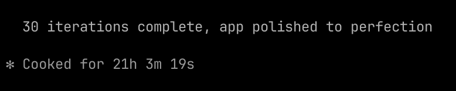

# Paideia

**Live at [usepaideia.com](https://usepaideia.com)**

<video src="https://github.com/markmdev/paideia/raw/main/paideia-demo-final.mp4" controls width="100%"></video>

---

## The Problem

Teachers are drowning.

44% of K-12 teachers report burnout. 55% plan to leave the profession early. The U.S. lost 500,000+ educators since the pandemic. The ones who stay spend their evenings grading — an 8th-grade English teacher with 150 students spends 37.5 hours grading a single essay assignment. Feedback reaches students 3–4 weeks late, when it's already useless.

Meanwhile, 7.5 million students with disabilities need Individualized Education Programs — legally binding documents that take 3–10 hours each to write. SPED teachers are drowning in paperwork while their students sit in front of computer programs. 51% of them have resorted to using ChatGPT to draft IEP content, creating FERPA violations because no compliant tool exists.

Parents get report cards filled with cryptic codes like "ELA.RI.4.2: Approaching" and have no idea if their child is OK. They juggle 5 different school apps and still can't answer the most basic question: *is my kid learning?*

## The Solution

Paideia is a K-12 education platform that unifies the entire teaching lifecycle — planning, grading, IEPs, parent communication, and district analytics — into one AI-native system. It replaces the 5–10 disconnected tools teachers currently juggle.

A teacher can grade an entire class of essays in 90 seconds with rubric-aligned, individualized feedback. A SPED teacher can draft a complete IEP in under an hour instead of ten. Parents get plain-language progress updates that tell them exactly what their child is learning and one thing they can do at home to help. Students get a Socratic AI tutor that asks guiding questions instead of giving answers.

Every interaction accumulates intelligence. Grading data reveals mastery gaps. Gaps drive differentiated instruction. Instruction outcomes feed parent insights. The platform gets smarter with every assignment.

**Try it live:** [usepaideia.com](https://usepaideia.com) — click any demo role button on the login page (Teacher, SPED Teacher, Admin, Parent, or Student). Each click creates a fresh, isolated sandbox.

## How It Was Built

One human. Zero lines of code written by hand. Claude did everything.

### Research Phase — 10 Subagents in Parallel

Claude Code launched 10 specialized research subagents simultaneously, each investigating a different field: K-12 education pain points, SPED compliance requirements, AI tutoring research, EdTech market dynamics, teacher community sentiment (Reddit r/Teachers, r/specialed, r/slp), parent perspectives, competitor analysis, regulatory frameworks (FERPA, COPPA, IDEA), district procurement patterns, and peer-reviewed studies from Harvard, Stanford, and CMU.

Each agent returned structured findings. Claude Code synthesized all 10 reports to identify the highest-impact problem space.

### Decision Phase — 5 Subagents Debating via Agent Teams

Claude Code then spawned 5 subagents — each representing a different stakeholder perspective (teacher, SPED specialist, parent, administrator, student) — and had them debate the product direction using Claude Code's multi-agent coordination. They challenged each other's assumptions, identified blind spots, surfaced trade-offs between user needs, and converged on a unified product vision.

The result: a [16,000-word Vision & PRD document](.meridian/docs/VISION-PRD.md) covering 5 user roles, 5 platform modules, a student AI tutor, pricing strategy, go-to-market plan, and 943 behavioral requirements — all written collaboratively by AI agents.

### Implementation Phase — 21 Hours, Fully Autonomous

Claude Code took the PRD and built the entire application in a single autonomous session. 55 API endpoints. 40+ dashboard pages. 13 AI service modules. 33 database tables. 192 passing tests. Authentication, role-based access, real-time streaming, and every AI feature powered by Claude Opus — grading essays, writing IEP goals, generating lesson plans, tutoring students through Socratic dialogue.

Then it reviewed its own code, found bugs, fixed them, refactored, and ran 30 iterations of browser testing to polish the UI. It bought a domain, configured DNS, and deployed itself to production.

### Video — Claude Cowork

The demo video was generated by Claude Cowork — another Claude session that scripted, captured, and composed the submission video.

**It's Claude all the way down.**

## Real-World Impact

This isn't a toy demo. The numbers behind every feature come from real research:

- **Grading**: Teachers spend 5+ hours/week grading. Paideia collapses a 37.5-hour essay grading cycle to under 30 minutes of review time.
- **SPED/IEP**: Due process hearings cost districts $50K–$200K each. Automated compliance tracking and individualized IEP generation directly reduce litigation risk.
- **AI Tutoring**: Harvard RCT showed 2x learning gains. Stanford showed 4 percentage point mastery improvement. CMU showed 0.36 grade levels ahead. Paideia's Socratic tutor is grounded in this evidence.
- **Parent Engagement**: 60% of teachers already use AI but parents hear nothing about it. Paideia gives parents plain-language insights, multilingual by default, with full AI transparency.
- **Teacher Retention**: Teachers using AI tools weekly save 5.9 hours/week — equivalent to six weeks over the school year. That's the difference between staying and quitting.

## The Executable English Specification

After building the application, Claude distilled it into **943 behavioral tests written in plain English**. No code. Just precise Given/When/Then descriptions of every API endpoint, every permission check, every AI service contract.

Hand the [`spec/`](spec/) directory to any AI coding agent and say: *"Translate every English test into a real test. Then implement until all tests pass."* The agent produces a fully functional Paideia in any language. The code is ephemeral. The specification is the product.

**[Read the full spec →](spec/README.md)**

## By the Numbers

| | |
|---|---|
| Autonomous build time | **21 hours 3 minutes** |
| Research subagents (parallel) | **10** |
| Debate subagents (Agent Teams) | **5** |
| Build iterations | **30** |
| API endpoints | **55** |
| Dashboard pages | **40+** |
| AI service modules | **13** (21 functions) |
| Database tables | **33+** |
| English behavioral tests | **943** |
| Coded tests | **192** |
| Lines of specification | **15,987** |
| Human-written lines of code | **0** |
